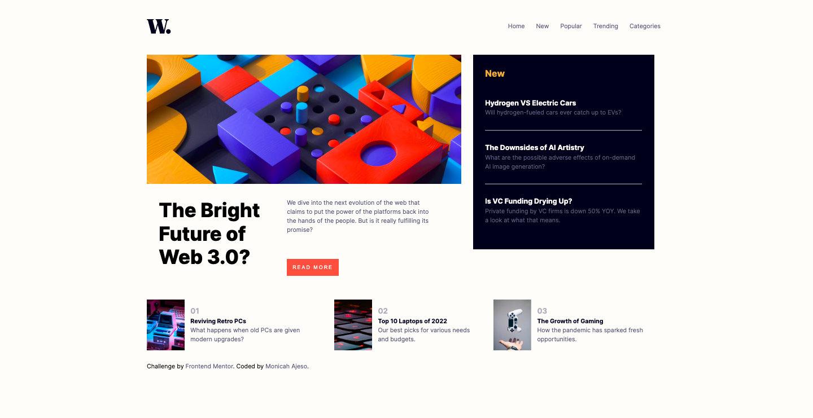

# Frontend Mentor - News homepage solution

This is a solution to the [News homepage challenge on Frontend Mentor](https://www.frontendmentor.io/challenges/news-homepage-H6SWTa1MFl).

## Table of contents

- [Overview](#overview)
  - [The challenge](#the-challenge)
  - [Screenshot](#screenshot)
  - [Links](#links)
- [My process](#my-process)
  - [Built with](#built-with)
  - [What I learned](#what-i-learned)
  - [Continued development](#continued-development)
  - [Useful resources](#useful-resources)
- [Author](#author)
- [Acknowledgments](#acknowledgments)

## Overview

Overview the challenge was really fun for me and I have learned alot from this.

### The challenge

Users should be able to:

- View the optimal layout for the interface depending on their device's screen size
- See hover and focus states for all interactive elements on the page

### Screenshot



### Links

- Solution URL: [Add solution URL here](https://your-solution-url.com)
- Live Site URL: [Add live site URL here](https://your-live-site-url.com)

## My process

### Built with

- Semantic HTML5 markup
- SASS
- Flexbox
- CSS Grid
- Mobile-first workflow
- Javascript

### What I learned

when I started this challenge my goal was to practice and use Sass for the first time and I must say I chose the right challenge for this.
Here are some of the things that I learnt.

This links your generated and compiled css to the html since you can not have .scss extension for the link

```html
<link rel="stylesheet" href="scss/style.css" />
```

```css
.proud-of-this-css {
  color: papayawhip;
}
```

```js
const proudOfThisFunc = () => {
  console.log("🎉");
};
```

If you want more help with writing markdown, we'd recommend checking out [The Markdown Guide](https://www.markdownguide.org/) to learn more.

### Continued development

I want to master JavaScript so this challenges I'm taking they help me increase my HTML and Css knowledge whilst learning JavaScript.

### Useful resources

- [Example resource 1](https://www.youtube.com/watch?v=nu5mdN2JIwM&t=1289s&ab_channel=TraversyMedia) - This helped me with Sass I really liked this tutorial and will use it going forward.

## Author

- Website - [Monicah Ajeso](https://www.ajeso.dev)
- Frontend Mentor - [@Ajeso](https://www.frontendmentor.io/profile/Ajeso)
  -Twitter - [@MonicahAjeso](https://twitter.com/MonicahAjeso)

## Acknowledgments

I want to thank me for taking this step and finishing this challenge. I further challenge myself to a challenge a day.
